# Chapter1. 실습코드(FE)

### [VSCode] 웹을 위한 Vscode 사용

- html 사용을 위한 확장

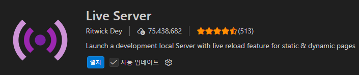

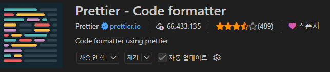

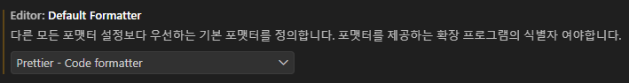

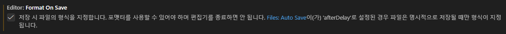

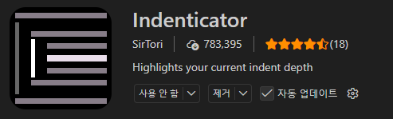

Ctrl + , 눌러서 bracket pair 를 검색한뒤

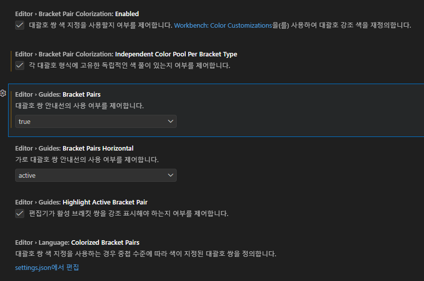

[데이터수집] 구글 스프레드시트를 활용한 온라인 설문지 조사

- 구글에 접속
  
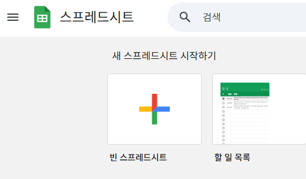

- 1. 데이터 수집용 일반 스프레드 시트 생성 및 저장
- 2. 왼쪽 메뉴 설문지 파트에서 설문지 양식 작성

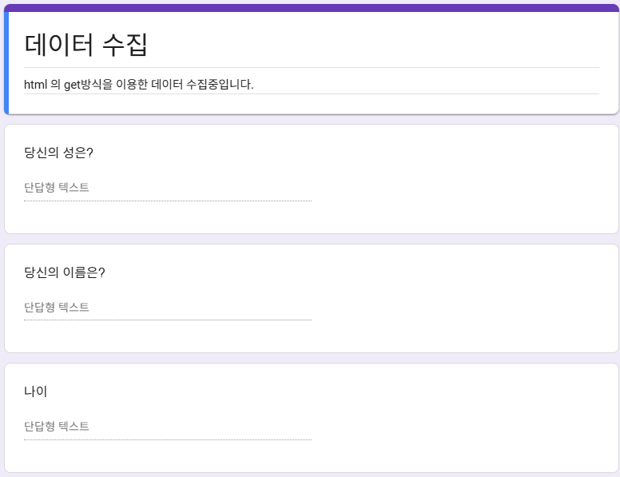

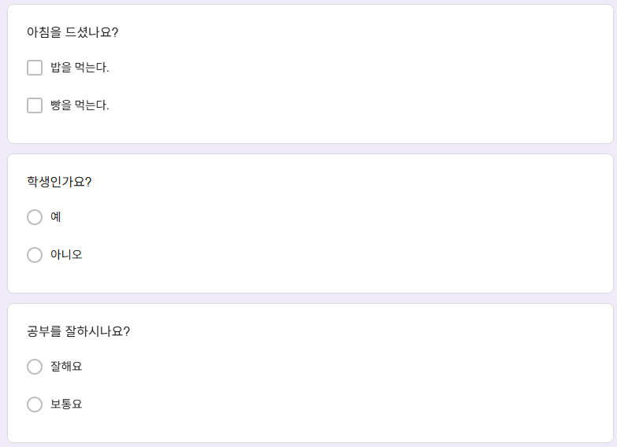

- 3. 시트연결

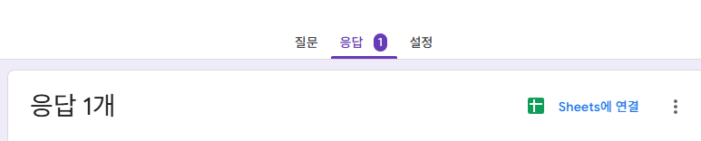

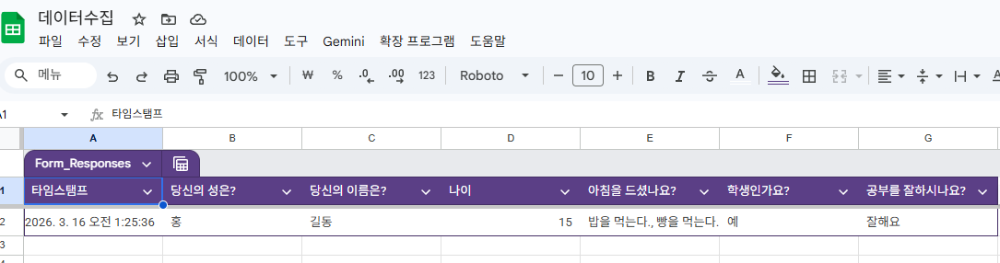

- 4. 아까 생성한 스프레드시트를 선택

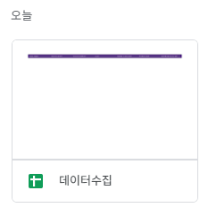

- 5. 설문지링크를 실행해서 내용을 뜯어본다.

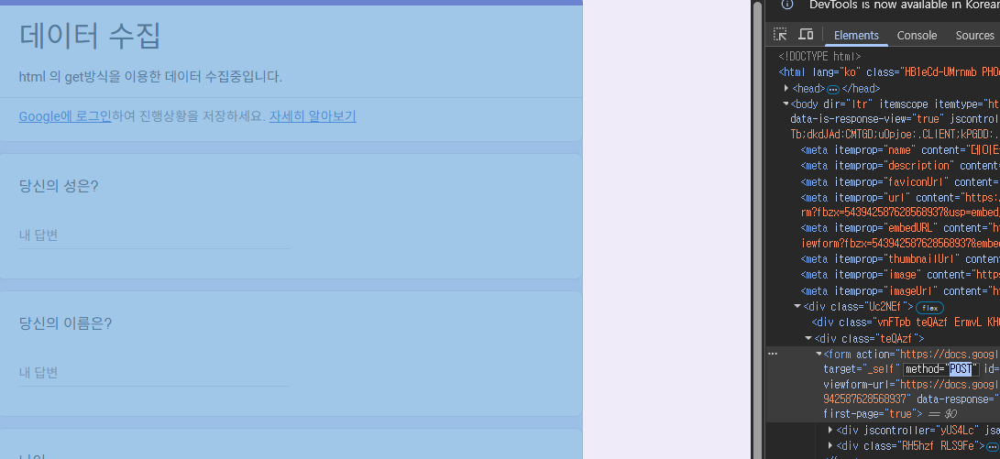

- 6. Form 양식 안에 있는 method 를 GET으로 바꾼다.(기본값이 GET이기에 method를 삭제해도 됨.)
  
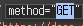

- 7. 임의의 값을 작성후 제출하면 URL에 쿼리스트링이 보인다.
? 뒤의 값을 기준과 &를 기준으로 정리하면

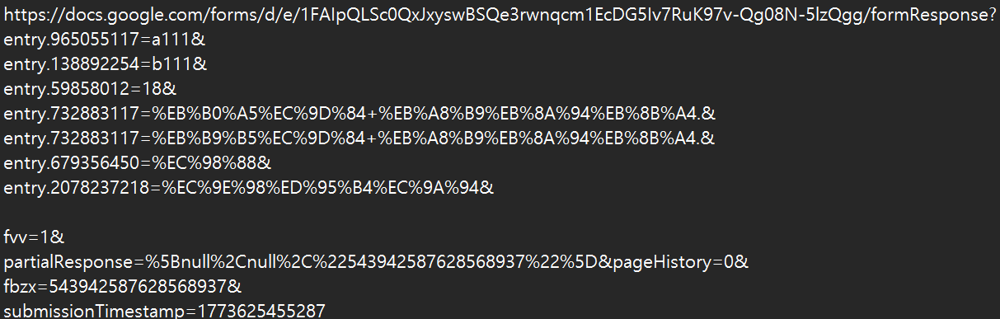

entry.숫지 = 값
형식이 보인다.

- 8. <form action="" 에 ? 앞의 호스트로 값을 추출하여 넣고 ? 뒤 값을 각 필드의 name 에도 넣는다.

- 9. 삽입 후 수정
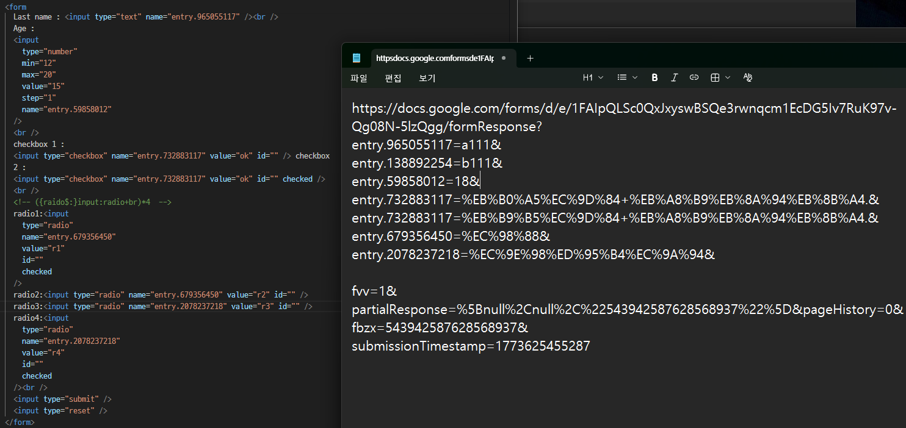

- 10. 정리된 코드
```html
<!doctype html>
<html lang="en">
  <head>
    <meta charset="UTF-8" />
    <meta name="viewport" content="width=device-width, initial-scale=1.0" />
    <title>Document</title>
  </head>
  <body>
    <h1>input 기능</h1>
    <hr />
    <a href="index.html">홈으로</a>
    <form
      action="https://docs.google.com/forms/d/e/1FAIpQLSc0QxJxyswBSQe3rwnqcm1EcDG5Iv7RuK97v-Qg08N-5lzQgg/formResponse"
      method="GET"
    >
      First name : <input type="text" name="entry.138892254" /><br />
      Last name : <input type="text" name="entry.965055117" /><br />
      Age :
      <input
        type="number"
        min="12"
        max="20"
        value="15"
        step="1"
        name="entry.59858012"
      />
      <hr />
      아침식사 밥? :
      <input
        type="checkbox"
        name="entry.732883117"
        value="밥을 먹는다."
        id=""
      /><br />
      아침식사 빵? :
      <input
        type="checkbox"
        name="entry.732883117"
        value="빵을 먹는다."
        id=""
        checked
      />
      <hr />
      <!-- ({raido$:}input:radio+br)*4  -->
      학생인가요?: <br />
      예<input type="radio" name="entry.679356450" value="예" id="" checked />
      아니오<input type="radio" name="entry.679356450" value="아니오" id="" />
      <hr />
      공부잘하나요? <br />
      잘해요:<input type="radio" name="entry.2078237218" value="잘해요" id="" />
      못해요:<input
        type="radio"
        name="entry.2078237218"
        value="보통요"
        id=""
        checked
      /><br />
      <input type="submit" />
      <input type="reset" />
    </form>
  </body>
</html>
```

gpt 도움을 얻어 css로 꾸미고

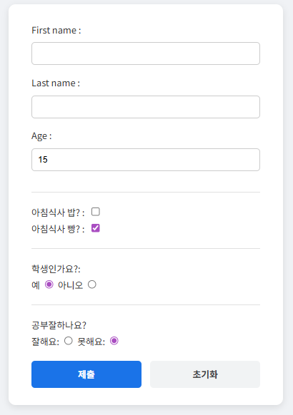

```html
<!doctype html>
<html lang="en">
  <head>
    <meta charset="UTF-8" />
    <meta name="viewport" content="width=device-width, initial-scale=1.0" />
    <title>Document</title>
    <style>
      /* 전체 페이지 기본 스타일 */
      body {
        font-family: "Pretendard", "Noto Sans KR", "Segoe UI", sans-serif;
        background-color: #f0f2f5;
        color: #333;
        display: flex;
        flex-direction: column;
        align-items: center;
        padding: 40px 20px;
        margin: 0;
      }

      /* 제목 스타일 */
      h1 {
        color: #1a73e8;
        margin-bottom: 10px;
      }

      /* '홈으로' 링크 스타일 */
      a {
        text-decoration: none;
        color: #5f6368;
        background-color: #fff;
        padding: 8px 16px;
        border-radius: 20px;
        box-shadow: 0 1px 3px rgba(0, 0, 0, 0.1);
        margin-bottom: 20px;
        transition: 0.2s;
        font-size: 14px;
        font-weight: bold;
      }
      a:hover {
        background-color: #e8eaed;
      }

      /* 폼 컨테이너(카드형) 스타일 */
      form {
        background: #ffffff;
        padding: 30px 40px;
        border-radius: 12px;
        box-shadow: 0 4px 12px rgba(0, 0, 0, 0.1);
        width: 100%;
        max-width: 400px;
        line-height: 1.8;
      }

      /* 구분선 스타일 */
      hr {
        border: none;
        border-top: 1px solid #e0e0e0;
        margin: 20px 0;
      }

      /* 텍스트 및 숫자 입력칸 스타일 */
      input[type="text"],
      input[type="number"] {
        width: 100%;
        padding: 10px;
        margin: 8px 0 16px 0;
        border: 1px solid #ccc;
        border-radius: 6px;
        box-sizing: border-box; /* 패딩 포함 너비 계산 */
        font-size: 15px;
        transition: border-color 0.3s;
      }

      input[type="text"]:focus,
      input[type="number"]:focus {
        border-color: #1a73e8;
        outline: none;
        box-shadow: 0 0 0 2px rgba(26, 115, 232, 0.2);
      }

      /* 라디오 버튼 및 체크박스 스타일 */
      input[type="radio"],
      input[type="checkbox"] {
        transform: scale(1.2);
        margin-left: 10px;
        margin-right: 5px;
        cursor: pointer;
      }

      /* 제출 및 초기화 버튼 스타일 */
      input[type="submit"],
      input[type="reset"] {
        width: 48%;
        padding: 12px;
        border: none;
        border-radius: 6px;
        font-size: 16px;
        font-weight: bold;
        cursor: pointer;
        margin-top: 20px;
        transition: background-color 0.3s;
      }

      input[type="submit"] {
        background-color: #1a73e8;
        color: white;
      }
      input[type="submit"]:hover {
        background-color: #1557b0;
      }

      input[type="reset"] {
        background-color: #f1f3f4;
        color: #3c4043;
        float: right; /* 버튼을 가로로 배치 */
      }
      input[type="reset"]:hover {
        background-color: #e8eaed;
      }
    </style>
  </head>
  <body>
    <h1>input 기능</h1>
    <hr />
    <a href="index.html">홈으로</a>
    <form
      action="https://docs.google.com/forms/d/e/1FAIpQLSc0QxJxyswBSQe3rwnqcm1EcDG5Iv7RuK97v-Qg08N-5lzQgg/formResponse"
      method="GET"
    >
      First name : <input type="text" name="entry.138892254" /><br />
      Last name : <input type="text" name="entry.965055117" /><br />
      Age :
      <input
        type="number"
        min="12"
        max="20"
        value="15"
        step="1"
        name="entry.59858012"
      />
      <hr />
      아침식사 밥? :
      <input
        type="checkbox"
        name="entry.732883117"
        value="밥을 먹는다."
        id=""
      /><br />
      아침식사 빵? :
      <input
        type="checkbox"
        name="entry.732883117"
        value="빵을 먹는다."
        id=""
        checked
      />
      <hr />
      학생인가요?: <br />
      예<input type="radio" name="entry.679356450" value="예" id="" checked />
      아니오<input type="radio" name="entry.679356450" value="아니오" id="" />
      <hr />
      공부잘하나요? <br />
      잘해요:<input type="radio" name="entry.2078237218" value="잘해요" id="" />
      못해요:<input
        type="radio"
        name="entry.2078237218"
        value="보통요"
        id=""
        checked
      /><br />
      <input type="submit" />
      <input type="reset" />
    </form>
  </body>
</html>
```

- 실습하면 잘됨
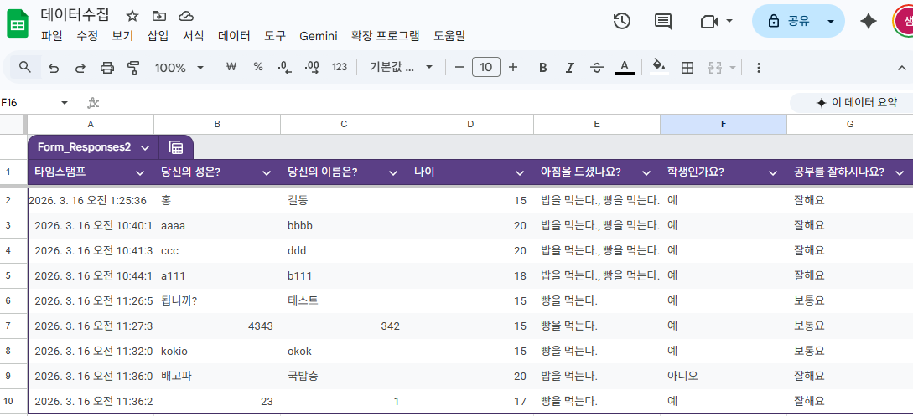

[Docker] 도커 톰켓으로 서버 돌려서 html 테스트하기
1. Dockerfile 이름으로 도커파일 작성
   
```Dockerfile
FROM tomcat:9.0-jdk11-openjdk
WORKDIR /usr/local/tomcat
EXPOSE 8080
COPY test.jsp webapps/ROOT/test.jsp
CMD ["catalina.sh","run"]
```

2. test.jsp 이름으로 파일작성
```JAVA
<%@ page language="java" contentType="text/html; charset=UTF-8"
    pageEncoding="UTF-8"%>

<%
request.setCharacterEncoding("UTF-8");

/* 가격 설정 */
int gift3 = 38000;
int gift5 = 52000;
int home3 = 30000;
int home4 = 47000;

/* 수량 초기화 */
int qty1 = 0;
int qty2 = 0;
int qty3 = 0;
int qty4 = 0;

/* 총가격 초기화 */
int total1 = 0;
int total2 = 0;
int total3 = 0;
int total4 = 0;

/* 파라미터가 null이 아니면 값 세팅 (빈 문자열 에러 방지 포함) */
if(request.getMethod().equalsIgnoreCase("POST")){
    String p1 = request.getParameter("qty1");
    String p2 = request.getParameter("qty2");
    String p3 = request.getParameter("qty3");
    String p4 = request.getParameter("qty4");

    if (p1 != null && !p1.trim().isEmpty()) qty1 = Integer.parseInt(p1);
    if (p2 != null && !p2.trim().isEmpty()) qty2 = Integer.parseInt(p2);
    if (p3 != null && !p3.trim().isEmpty()) qty3 = Integer.parseInt(p3);
    if (p4 != null && !p4.trim().isEmpty()) qty4 = Integer.parseInt(p4);

    total1 = qty1 * gift3;
    total2 = qty2 * gift5;
    total3 = qty3 * home3;
    total4 = qty4 * home4;
}
%>

<!doctype html>
<html lang="en">
  <head>
    <meta charset="UTF-8" />
    <meta name="viewport" content="width=device-width, initial-scale=1.0" />
    <title>상품 주문</title>
    <style>
      /* 입력창과 버튼을 조금 더 깔끔하게 보이게 하는 약간의 스타일 */
      input[type="number"] {
        width: 60px;
        text-align: right;
      }
      .submit-btn {
        margin-top: 15px;
        padding: 8px 16px;
        font-size: 16px;
        cursor: pointer;
      }
    </style>
  </head>
  <body>
    
    <form action="test.jsp" method="post">
      <table width="100%" border="1" style="border-collapse: collapse;">
        <caption>
          <h3>선물용과 가정용 상품 구성</h3>
        </caption>
        
        <colgroup>
          <col style="background-color: bisque" />
          <col span="2" style="background-color: rgb(98, 142, 238)" />
          <col span="3" style="background-color: rgb(106, 203, 216)" />
        </colgroup>
        
        <thead>
          <tr>
            <th>용도</th>
            <th>중량</th>
            <th>과수(개수)</th>
            <th>상자가격</th>
            <th>주문 수량</th>
            <th>총 가격</th>
          </tr>
        </thead>
        
        <tbody style="text-align: center">
          <tr>
            <td rowspan="2">선물용</td>
            <td>3Kg</td>
            <td>11~16과</td>
            <td>38,000원</td>
            <td>
              <input type="number" name="qty1" min="0" value="<%= (qty1 > 0) ? qty1 : "" %>">
            </td>
            <td><%= total1 %> 원</td>
          </tr>
          <tr>
            <td>5Kg</td>
            <td>18~26과</td>
            <td>52,000원</td>
            <td>
              <input type="number" name="qty2" min="0" value="<%= (qty2 > 0) ? qty2 : "" %>">
            </td>
            <td><%= total2 %> 원</td>
          </tr>
          
          <tr>
            <td rowspan="2">가정용</td>
            <td>3Kg</td>
            <td>11~16과</td>
            <td>30,000원</td>
            <td>
              <input type="number" name="qty3" min="0" value="<%= (qty3 > 0) ? qty3 : "" %>">
            </td>
            <td><%= total3 %> 원</td>
          </tr>
          <tr>
            <td>4Kg</td>
            <td>18~26과</td>
            <td>47,000원</td>
            <td>
              <input type="number" name="qty4" min="0" value="<%= (qty4 > 0) ? qty4 : "" %>">
            </td>
            <td><%= total4 %> 원</td>
          </tr>
        </tbody>
      </table>
      
      <div style="text-align: center;">
        <input type="submit" value="총 가격 계산" class="submit-btn">
      </div>
      
    </form>

  </body>
</html>
```

3. 위 내용의 위치는
project/
├─ Dockerfile
└─ test.jsp
이렇게 바로 옆에 두어야 한다.

4. 다음으로 이미지를 빌드한다.
   
```SH
docker build -t my-web .
```

5. 다음으로 컨테이너 파일을 생성한다.
```SH
docker run -p 8080:8080 --name myweb my-web
```

6. 웹페이지에 접속한다.
```URL
http://localhost:8080/test.jsp
```

etc jsp의 변경점이 있어서 확실한 캐시삭제 후 재빌드 하려면?
```SH
docker build --no-cache -t my-web .
```

[CSS] reset 파일

```css
html, body, div, span, applet, object, iframe,
h1, h2, h3, h4, h5, h6, p, blockquote, pre,
a, abbr, acronym, address, big, cite, code,
del, dfn, em, img, ins, kbd, q, s, samp,
small, strike, strong, sub, sup, tt, var,
b, u, i, center,
dl, dt, dd, ol, ul, li,
fieldset, form, label, legend,
table, caption, tbody, tfoot, thead, tr, th, td,
article, aside, canvas, details, embed,
figure, figcaption, footer, header, hgroup,
menu, nav, output, ruby, section, summary,
time, mark, audio, video {
    margin: 0;
    padding: 0;
    border: 0;
    font-size: 100%;
    font: inherit;
    vertical-align: baseline;
}

article, aside, details, figcaption, figure,
footer, header, hgroup, menu, nav, section {
    display: block;
}

body {
    line-height: 1;
}

ol, ul {
    list-style: none;
}

blockquote, q {
    quotes: none;
}
blockquote:before, blockquote:after,
q:before, q:after {
    content: '';
    content: none;
}

table {
    border-collapse: collapse;
    border-spacing: 0;
}
```

[CSS] 가상선택자 예제

```html
<!doctype html>
<html lang="ko">
  <head>
    <meta charset="UTF-8" />
    <meta name="viewport" content="width=device-width, initial-scale=1.0" />
    <title>가상선택자</title>
    <style>
      a:visited {
        color: cadetblue;
      }
      a:active {
        color: red;
      }
      input:focus {
        background-color: rgb(241, 252, 144);
      }
      button:disabled {
        background-color: rgb(235, 216, 216);
      }
      .red-focus:focus {
        background-color: red;
      }
      .blue-focus:focus {
        background-color: blue;
      }
      input[type="checkbox"]:checked + label {
        color: red;
        text-decoration: line-through;
      }
      div {
        border: 1px solid black;
        width: 20px;
        height: 20px;
        margin: 3px;
        background-color: cadetblue;
        /* display: inline-block; */
      }
      div:hover {
        background-color: yellow;
        width: 40px;
      }
    </style>
  </head>
  <body>
    <h1>가상선택자 응용</h1>
    <hr />
    <a href="index.html">홈으로</a><br />
    <hr />
    <a href="https://naver.com">네이버</a>
    <hr />
    <input type="text" placeholder="내용을 입력하세요" />
    <button disabled>전송</button><br />
    <input type="text" class="red-focus" value="클릭하면 빨갛게 변합니다." />
    <input type="text" class="blue-focus" value="클릭하면 파랗게 변합니다." />
    <hr />
    <input type="checkbox" id="snack" />
    <label for="snack">간식</label>
    <input type="checkbox" id="food" />
    <label for="food">식사</label>
    <hr />
    <div></div>
    <div></div>
    <div></div>
    <div></div>
    <div></div>
    <div></div>
    <div></div>
    <div></div>
    <div></div>
    <div></div>
  </body>
</html>
```

[CSS] 속성선택자 예제

```html
<!doctype html>
<html lang="ko">
  <head>
    <meta charset="UTF-8" />
    <meta name="viewport" content="width=device-width, initial-scale=1.0" />
    <title>속성선택자</title>
    <style>
      /* 속성의 키값만 */
      /* [ys] {
        color: blueviolet;
      } */
      /* 속성명과 정확하게 지정 */
      /* p[class="item"] {
        color: rgb(33, 168, 6);
      } */
      /* item이 들어가거나 item- 시리즈일때 */
      p[class|="item"] {
        color: blue;
      }
      /* item이라고 문구가 들어가면 모두다 */
      /* p[class*="item"] {
        color: rgb(218, 90, 5);
      } */
      /* item 문구가 혼자있거나 뒤에 배치될 때 */
      /* p[class$="item"] {
        color: rgb(194, 226, 14);
      } */
      /* item 문구가 혼자있거나 앞에 배치될 때 */
      /* p[class^="item"] {
        color: rgb(16, 239, 255);
      } */
      /* item 이 순수히 혼자 글자일 때 */
      /* p[class~="item"] {
        color: rgb(250, 125, 223);
      } */
    </style>
  </head>
  <body>
    <h1>속성선택자</h1>
    <hr />
    <a href="index.html">홈으로</a><br />
    <h2 ys="who">속성선택자의 내용</h2>
    <h2 class="logo">부산광역시</h2>
    <h2 id="kyungsang">경상도</h2>
    <!-- p.item{작성합니다}*7 -->
    <p class="item">주소록을 작성합니다</p>
    <p class="itempage">전화번호를 작성합니다</p>
    <p class="screenitem">건강기록부를 작성합니다</p>
    <p class="who item me">금전출납부를 작성합니다</p>
    <p class="item-1">손익계산서를 작성합니다</p>
    <p class="item-a">이익계산서를 작성합니다</p>
    <p class="a-item">손해계산서를 작성합니다</p>
  </body>
</html>
```

[JS] DOM 과 스크립트 실행 방식 크게 3가지

| 방식               | 실행 시점       | 특징             |
| ---------------- | ----------- | -------------- |
| body 끝           | DOM 생성 후    | 가장 단순          |
| DOMContentLoaded | DOM 완료 시    | 이벤트 기반         |
| defer            | DOM 완료 후 자동 | **가장 깔끔 (추천)** |


```html
<!doctype html>
<html lang="ko">
  <head>
    <meta charset="UTF-8" />
    <meta name="viewport" content="width=device-width, initial-scale=1.0" />
    <title></title>
    <script>
      document.addEventListener("DOMContentLoaded", () => {
        const dollar = +prompt("환전할 달러를 입력해주세요.", 1);
        const ex = 1500;
        const won = dollar * ex;
        const list = `<h2>환전하실 ${dollar}달러는 ${won}원 입니다.</h2>`;
        // document.write(list) // 이전 방식 권장안함
        document.body.innerHTML = list;
        // document.body.textContent = list
      });
    </script>
  </head>
  <body>
    <h1>반가워요!!!!</h1>
  </body>
</html>
```


> **📝 AI 요약**
> - `setTimeout`은 지정된 시간 후에 함수를 한 번 실행하고, `clearTimeout`으로 취소할 수 있습니다.
> - `setInterval`은 지정된 시간 간격으로 함수를 반복 실행하고, `clearInterval`로 중지할 수 있습니다.
> - 제공된 HTML 예제는 `setInterval`을 사용하여 1초마다 타이머를 증가시키고, 버튼으로 시작 및 정지 기능을 구현합니다.

## [JS] setTimeout, setInterval

`setTimeout`, `clearTimeout`, `setInterval`, `clearInterval`에 대한 설명과 예제를 제공합니다.

### setTimeout
`setTimeout` 함수는 지정된 시간(밀리초) 후에 함수를 한 번 실행합니다.

```javascript
setTimeout(() => {
  console.log('3초 후에 실행됩니다.');
}, 3000);
```

### clearTimeout
`clearTimeout` 함수는 `setTimeout`으로 예약된 함수 실행을 취소합니다.

```javascript
const timeoutId = setTimeout(() => {
  console.log('이 메시지는 보이지 않습니다.');
}, 2000);

clearTimeout(timeoutId);
console.log('setTimeout이 취소되었습니다.');
```

### setInterval
`setInterval` 함수는 지정된 시간(밀리초) 간격으로 함수를 계속해서 실행합니다.

```javascript
let count = 0;
const intervalId = setInterval(() => {
  count++;
  console.log(`${count}초 경과`);
  if (count >= 5) {
    clearInterval(intervalId);
    console.log('setInterval이 중지되었습니다.');
  }
}, 1000);
```

### clearInterval
`clearInterval` 함수는 `setInterval`로 예약된 반복 실행을 취소합니다.

```javascript
// 아래는 HTML 예제 코드와 함께 작동합니다.
<!doctype html>
<html lang="ko">
  <head>
    <meta charset="UTF-8" />
    <meta name="viewport" content="width=device-width, initial-scale=1.0" />
    <title>타이머 예제</title>
    <style>
      .box {
        margin: 40% auto;
        text-align: center;
      }
    </style>
  </head>
  <body>
    <div class="box">
      <h1><span id="timer">0</span>초 마다 진행</h1>
      <button onclick="startTimer()">시작</button>
      <button onclick="stopTimer()">정지</button>
    </div>
    <script>
      let count = 0; // 전역 변수로 설정
      let intervalId = null; // undefined 대신 null로 초기화

      const startTimer = () => {
        console.log('시작 버튼 클릭:', intervalId);
        if (intervalId) return; // 중복 실행 방지
        intervalId = setInterval(() => {
          document.querySelector("#timer").textContent = ++count;
        }, 1000);
        console.log('setInterval 시작:', intervalId);
      };

      const stopTimer = () => {
        clearInterval(intervalId);
        intervalId = null; // 초기화
        console.log('setInterval 중지:', intervalId);
      };
    </script>
  </body>
</html>
```

##### [AI 수정 내역]
###### 에 대한 설명과 예제를 제공합니다.(설명과 예제 추가:), ## setTimeout(setTimeout), `setTimeout` 함수는 지정된 시간(밀리초) 후에 함수를 한 번 실행합니다.(setTimeout 함수는 지정된 시간(밀리초) 후에 함수를 한 번 실행합니다.), ## clearTimeout(clearTimeout), `clearTimeout` 함수는 `setTimeout`으로 예약된 함수 실행을 취소합니다.(clearTimeout 함수는 `setTimeout`으로 예약된 함수 실행을 취소합니다.), ## setInterval(setInterval), `setInterval` 함수는 지정된 시간(밀리초) 간격으로 함수를 계속해서 실행합니다.(setInterval 함수는 지정된 시간(밀리초) 간격으로 함수를 계속해서 실행합니다.), ## clearInterval(clearInterval), `clearInterval` 함수는 `setInterval`로 예약된 반복 실행을 취소합니다.(clearInterval 함수는 `setInterval`로 예약된 반복 실행을 취소합니다.), let count = 0; // 전역 변수로 설정

      let intervalId = null; // undefined 대신 null로 초기화(let num = 0; // 전역으로 설정
      let iid; // undefined 로 시작), const startTimer = () => {(const start = () => {), if (intervalId) return; // 중복 실행 방지(if (iid) return; // 중복실행 방지), intervalId = setInterval((iid = setInterval(), const stopTimer = () => {(const stop = () => {), clearInterval(intervalId);
        intervalId = null; // 초기화(clearInterval(iid);
        iid = null; // 초기화), console.log('setInterval 시작:', intervalId);(console.log(iid);), console.log('setInterval 중지:', intervalId);(console.log(iid);), button onclick="startTimer()"(button onclick="start()"), button onclick="stopTimer()"(button onclick="stop()"), let count = 0; // 전역 변수로 설정
      let intervalId = null; // undefined 대신 null로 초기화

      const startTimer = () => {
        console.log('시작 버튼 클릭:', intervalId);
        if (intervalId) return; // 중복 실행 방지
        intervalId = setInterval(() => {
          document.querySelector("#timer").textContent = ++count;
        }, 1000);
        console.log('setInterval 시작:', intervalId);
      };

      const stopTimer = () => {
        clearInterval(intervalId);
        intervalId = null; // 초기화
        console.log('setInterval 중지:', intervalId);
      };
    </script>(let num = 0; // 전역으로 설정
      let iid; // undefined 로 시작

      const start = () => {
        console.log(iid);
        if (iid) return; // 중복실행 방지
        iid = setInterval(
          () => (document.querySelector("#timer").textContent = ++num),
          1000,
        );
        console.log(iid);
      };
      const stop = () => {
        clearInterval(iid);
        iid = null; // 초기화
        console.log(iid);
      };
    </script>)


### [JS] script 의 위치별 기능

```html
<!doctype html>
<html lang="ko">
  <head>
    <meta charset="UTF-8" />
    <meta name="viewport" content="width=device-width, initial-scale=1.0" />
    <title></title>
    <script>
      const h2 = (text) => `<h2>${text}</h2>`;
      document.addEventListener("DOMContentLoaded", () => {
        document.body.innerHTML += h2("=== DOMContentLoaded 이벤트 발생 ===");
        document.body.innerHTML += h2("1번째 script 로 작성된 h2 태그");
      });
    </script>
  </head>
  <body>
    <script>
      document.body.innerHTML += h2("2번째 script 로 작성된 h2 태그");
    </script>

    <h2>1번째 h2 태그</h2>
    <script>
      document.body.innerHTML += h2("3번째 script 로 작성된 h2 태그");
    </script>

    <h2>2번째 h2 태그</h2>
  </body>
</html>
```

### [JS] 라이브러리 활용 실습하기

https://www.typeitjs.com/

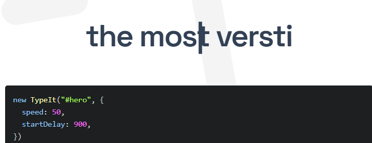

### [웹] To Do List
```html
<!doctype html>
<html lang="ko">
  <head>
    <meta charset="UTF-8" />
    <meta name="viewport" content="width=device-width, initial-scale=1.0" />
    <title></title>
    <style>
      body {
        margin: 40px;
      }
      input,
      button {
        padding: 6px;
      }
      input {
        width: 70%;
      }
      button {
        border: none;
        background-color: cadetblue;
        color: white;
        cursor: pointer;
      }
      li {
        width: 70%;
        list-style-type: none;
        padding: 6px 0;
        border-bottom: 1px solid #ccc;
        cursor: pointer;
      }
      li:hover {
        background-color: aliceblue;
      }
      li.done {
        color: #aaa;
        text-decoration: line-through;
        background-color: rgb(245, 244, 244);
      }
    </style>
  </head>
  <body>
    <h2>Todo List</h2>
    <input type="text" id="input" placeholder="할 일 입력" />
    <button id="add">추가</button>
    <ul id="list"></ul>
    <script>
      const input = document.querySelector("#input");
      const addBtn = document.querySelector("#add");
      const list = document.querySelector("#list");
      /* 엔터동작추가 */

      const inEnter = () => {
        const li = document.createElement("li");
        /* 빈칸제외 */
        if (!input.value) return;

        /* 내용추가 */
        li.textContent = input.value;

        /* 클릭시 완료처리 */
        li.addEventListener("click", () => {
          li.classList.toggle("done");
        });

        /* 더블클릭시 삭제 */
        li.addEventListener("dblclick", () => {
          li.remove();
        });

        /* 내용비우기 */
        input.value = "";

        list.appendChild(li);
      };
      addBtn.addEventListener("click", inEnter);
      input.addEventListener("keydown", (event) => {
        if (event.key === "Enter") inEnter();
      });
    </script>
  </body>
</html>
```

# 프론트엔드 개발: 역사, 최신 트렌드 및 그 의미

## 개요
프론트엔드 개발은 사용자가 직접 접하는 웹사이트나 애플리케이션의 인터페이스를 구축하는 분야입니다. 웹 기술의 발전과 함께 프론트엔드 개발은 끊임없이 진화해왔으며, 오늘날에는 더욱 풍부하고 동적인 사용자 경험을 제공하는 것을 목표로 하고 있습니다. 이 글에서는 프론트엔드 개발의 역사적 흐름을 간략히 살펴보고, 현재의 주요 트렌드와 앞으로의 의미를 고찰해보고자 합니다.

## 프론트엔드 개발의 역사

초기의 웹은 주로 HTML을 사용하여 정적인 문서 형태로 정보를 제공했습니다. 웹 페이지의 내용은 텍스트와 이미지 위주였으며, 디자인이나 상호작용은 매우 제한적이었습니다. 이후 CSS가 등장하면서 웹 페이지의 시각적인 스타일링이 가능해졌고, 조금 더 매력적인 웹사이트를 만들 수 있게 되었습니다.

1990년대 중반, JavaScript의 등장은 프론트엔드 개발에 혁신을 가져왔습니다. JavaScript는 웹 페이지에 동적인 요소를 추가할 수 있게 하여, 사용자와의 상호작용을 가능하게 했습니다. 이를 통해 웹 애플리케이션의 가능성이 열렸고, 단순한 정보 전달 매체를 넘어선 서비스형 웹의 기반이 마련되었습니다.

2000년대 이후로는 AJAX(Asynchronous JavaScript and XML)와 같은 기술이 발전하면서, 페이지 전체를 새로고침하지 않고도 부분적으로 데이터를 업데이트할 수 있게 되었습니다. 이는 웹 애플리케이션의 속도와 사용자 경험을 크게 향상시키는 계기가 되었습니다. 또한, jQuery와 같은 JavaScript 라이브러리의 등장으로 개발 생산성이 높아졌습니다.

최근 10년간은 프레임워크와 라이브러리(React, Angular, Vue.js 등)의 시대라고 할 수 있습니다. 이러한 도구들은 복잡한 프론트엔드 애플리케이션을 더욱 구조적이고 효율적으로 개발할 수 있도록 지원하며, SPA(Single Page Application) 개발을 일반화했습니다.

## 요즘 프론트엔드 개발 트렌드

현재 프론트엔드 개발 생태계는 매우 빠르게 변화하고 있으며, 다음과 같은 트렌드가 두드러지고 있습니다.

### 1. 컴포넌트 기반 아키텍처 (Component-Based Architecture, CBA)

React, Vue.js와 같은 최신 프레임워크들은 UI를 재사용 가능한 독립적인 컴포넌트 단위로 나누어 개발하는 방식을 적극적으로 채택하고 있습니다. 이는 코드의 모듈화, 재사용성 증대, 유지보수성 향상에 크게 기여합니다.

### 2. 서버 사이드 렌더링 (Server-Side Rendering, SSR) 및 정적 사이트 생성 (Static Site Generation, SSG)

과거 SPA의 단점이었던 초기 로딩 속도 저하 및 SEO(검색 엔진 최적화) 문제를 해결하기 위해 SSR과 SSG가 주목받고 있습니다. Next.js (React), Nuxt.js (Vue.js)와 같은 프레임워크들은 이를 지원하며, 애플리케이션 성능과 검색 엔진 노출도를 동시에 높일 수 있습니다.

### 3. TypeScript의 대중화

JavaScript에 정적 타입 검사를 도입한 TypeScript는 대규모 프론트엔드 프로젝트에서 버그를 줄이고 코드의 안정성을 높이는 데 필수적인 도구로 자리 잡았습니다. 현재 많은 기업에서 TypeScript 사용을 권장하거나 의무화하고 있습니다.

### 4. 웹 컴포넌트 (Web Components)

프레임워크에 독립적인 방식으로 재사용 가능한 UI 컴포넌트를 만들 수 있는 웹 표준 기술인 웹 컴포넌트의 활용도 점차 증가하고 있습니다. 이는 특정 프레임워크에 종속되지 않는 솔루션을 구축하는 데 유용합니다.

### 5. 성능 최적화 및 사용자 경험(UX) 중심 개발

빠른 로딩 속도, 부드러운 인터랙션 등 사용자 경험은 여전히 가장 중요한 요소입니다. 이를 위해 코드 스플리팅, 이미지 최적화, 캐싱 전략 등 다양한 성능 최적화 기법이 적극적으로 활용되고 있습니다.

### 6. 점진적 향상 (Progressive Enhancement) 및 접근성 (Accessibility)

모든 사용자가 웹 콘텐츠에 동등하게 접근할 수 있도록 보장하는 접근성(A11y)에 대한 중요성이 더욱 강조되고 있습니다. 또한, 기본적인 기능은 모든 브라우저에서 작동하게 하고, 이후 브라우저 기능에 따라 점진적으로 향상시키는 점진적 향상 전략도 꾸준히 고려되고 있습니다.

## 프론트엔드 개발 트렌드의 의미

이러한 트렌드들은 프론트엔드 개발이 단순한 UI 구현을 넘어, **성능, 확장성, 유지보수성, 그리고 궁극적으로는 사용자에게 최고의 경험을 제공하는 복합적인 엔지니어링 분야**로 발전하고 있음을 보여줍니다.

-   **개발 효율성 및 생산성 향상**: 프레임워크, 라이브러리, TypeScript 등은 복잡한 애플리케이션을 더 빠르고 효율적으로 개발할 수 있게 합니다.
-   **애플리케이션 성능 및 사용자 경험 극대화**: SSR, SSG, 최적화 기법 등은 사용자에게 빠르고 쾌적한 경험을 제공하는 데 집중하고 있습니다.
-   **코드의 안정성 및 유지보수 용이성**: 컴포넌트 기반 설계와 TypeScript는 코드의 질을 높여 장기적인 프로젝트의 유지보수를 용이하게 합니다.
-   **웹의 포용성 증대**: 접근성에 대한 고려는 더 많은 사용자가 웹 서비스의 혜택을 누릴 수 있도록 합니다.

## 결론

프론트엔드 개발은 끊임없이 진화하는 분야이며, 최신 트렌드를 이해하고 적용하는 것은 개발자로서 경쟁력을 유지하는 데 필수적입니다. 과거의 단순한 페이지 구성에서 벗어나, 이제는 성능, 사용자 경험, 코드 품질, 접근성 등 다방면에 걸친 고려가 요구되는 정교한 엔지니어링 영역으로 자리매김하고 있습니다.

# Chapter 2. 팁정리
## [팁] 정규표현식 활용 팁
### 개요
- 정규표현식(Regular Expression, RegEx)은 문자열에서 특정 패턴을 찾거나, 바꾸거나, 분리하는 데 사용되는 강력한 도구입니다. 다양한 프로그래밍 언어와 텍스트 편집기에서 활용되며, 복잡한 문자열 처리를 효율적으로 할 수 있도록 돕습니다.

### 주요 내용
1. 정규표현식의 기본 구성 요소
- 리터럴 문자 (Literal Characters): 'a', '1', '@' 등 일반 문자는 그대로 매칭됩니다.
- 메타 문자 (Metacharacters): 특별한 의미를 가지는 문자들입니다. 예: . (모든 문자), * (0회 이상 반복), + (1회 이상 반복), ? (0회 또는 1회 반복), [] (문자 집합), () (그룹화), | (OR 연산).
- 이스케이프 문자 (Escape Character): 메타 문자를 일반 문자로 사용하고 싶을 때 앞에 \를 붙입니다. 예: \.는 실제 점(.) 문자를 찾습니다.
  
2. 자주 사용되는 메타 문자 및 패턴
- . (점): 개행 문자를 제외한 모든 한 문자와 일치합니다.
- ^ (캐럿): 문자열의 시작과 일치합니다. (대괄호 [] 안에서는 NOT 연산자로 사용)
- $ (달러): 문자열의 끝과 일치합니다.
- *, +, ?: 앞선 문자가 반복되는 횟수를 지정합니다.
  - *: 0회 이상 반복
  - +: 1회 이상 반복
  - ?: 0회 또는 1회 반복
- {n}: 정확히 n번 반복
- {n,}: n번 이상 반복
- {n,m}: n번 이상 m번 이하 반복
- [] (대괄호): 문자 집합. 괄호 안의 문자 중 하나와 일치합니다. 예: [abc]는 'a', 'b', 'c' 중 하나와 일치합니다. [0-9]는 모든 숫자와 일치합니다.
- () (괄호): 그룹화. 여러 문자를 하나로 묶거나, 매칭된 부분을 캡처합니다.
- | (파이프): OR 연산자. (a|b)는 'a' 또는 'b'와 일치합니다.
  
3. 특수 문자 클래스
- \d: 숫자 ([0-9])와 일치합니다.
- \D: 숫자가 아닌 문자와 일치합니다 ([^0-9]).
- \w: 단어 문자 (알파벳, 숫자, 언더스코어 _)와 일치합니다 ([a-zA-Z0-9_]).
- \W: 단어 문자가 아닌 문자와 일치합니다 ([^a-zA-Z0-9_]).
- \s: 공백 문자 (스페이스, 탭, 줄바꿈 등)와 일치합니다.
- \S: 공백 문자가 아닌 문자와 일치합니다.
  
### 예시
- 이메일 주소 패턴: ^[a-zA-Z0-9._%+-]+@[a-zA-Z0-9.-]+\.[a-zA-Z]{2,}$

  - ^: 문자열 시작
  - [a-zA-Z0-9._%+-]+: 이메일 사용자 이름 부분 (영문, 숫자, . _ % + - 중 하나 이상)
  - @: @ 기호
  - [a-zA-Z0-9.-]+: 도메인 이름 부분
  - \.: 점(.)
  - [a-zA-Z]{2,}: 최상위 도메인 (최소 2글자)
  - $: 문자열 끝

- 전화번호 패턴 (한국): ^01[016789]-?(\d{3,4})-\d{4}$

  - ^01[016789]: 010, 011, 016, 017, 018, 019 로 시작
  - -?: 하이픈(-)은 있어도 되고 없어도 됨
  - (\d{3,4}): 중간 번호 (3~4자리 숫자)
  - \d{4}$: 마지막 번호 (4자리 숫자) 및 문자열 끝
  
### 정리
- 정규표현식은 처음에는 복잡해 보일 수 있지만, 기본적인 메타 문자와 패턴을 익히면 매우 유용하게 활용할 수 있습니다. 다양한 온라인 정규표현식 테스트 도구를 활용하여 연습하는 것이 실력 향상에 큰 도움이 됩니다.

## [VSCODE] 코드조각 설정하기
1. vscode 의 좌측하단 - 설정 - 코드조각 선택
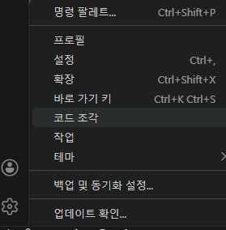

2. html 검색
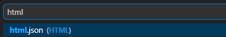

3. 아래와 같이 코드 단축 설정
$1,$2... 는 탭할 때 이동되는 지점

```JSON
{
	// Place your snippets for html here. Each snippet is defined under a snippet name and has a prefix, body and 
	// description. The prefix is what is used to trigger the snippet and the body will be expanded and inserted. Possible variables are:
	// $1, $2 for tab stops, $0 for the final cursor position, and ${1:label}, ${2:another} for placeholders. Placeholders with the 
	// same ids are connected.
	// Example:
	"Print to console": {
	"prefix": "!!",
	"body": [
		"<!DOCTYPE html>",
		"<html lang=\"ko\">",
		"<head>",
		"    <meta charset=\"UTF-8\">",
		"    <meta name=\"viewport\" content=\"width=device-width, initial-scale=1.0\">",
		"    <title>$1</title>",
		"</head>",
		"<body>",
		"    <h1>$2</h1>",
		"    <hr />",
		"    <a href=\"index.html\">홈으로</a><br />",
		"    $3",
		"</body>",
		"</html>"
	],
	"description": "my code snippet"
}
```

```JSON
{
    // 기존에 작성하신 코드 조각
    "Print to console": {
        "prefix": "!!!",
        "body": [
            "<!DOCTYPE html>",
            "<html lang=\"ko\">",
            "<head>",
            "    <meta charset=\"UTF-8\">",
            "    <meta name=\"viewport\" content=\"width=device-width, initial-scale=1.0\">",
            "    <title>$1</title>",
            "</head>",
            "<body>",
            "    <h1>$2</h1>",
            "    <hr />",
            "    <a href=\"index.html\">홈으로</a><br />",
            "    $3"
        ],
        "description": "my code snippet"
    },
    // 새로 추가된 코드 조각 (쉼표로 구분됨)
    "HTML with Script Boilerplate": {
        "prefix": "!!",
        "body": [
            "<!doctype html>",
            "<html lang=\"ko\">",
            "  <head>",
            "    <meta charset=\"UTF-8\" />",
            "    <meta name=\"viewport\" content=\"width=device-width, initial-scale=1.0\" />",
            "    <title></title>",
            "    <script>$1</script>",
            "  </head>",
            "  <body>",
            "  </body>",
            "</html>"
        ],
        "description": "HTML template with script tags"
    }
}
```

## [VSCODE] 확장모듈 정리
Win + Shift + P

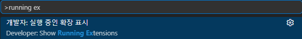

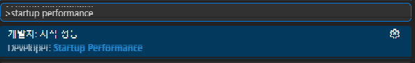

## [팁]code runner 한글 깨짐 조치
Ctrl + , 를 눌러서 conde runner run 입력후
RUn in Terminal 에 체크하기

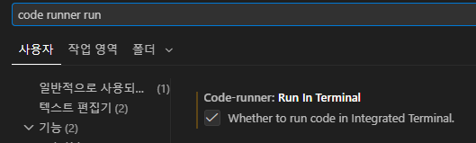

## [Ollama] 로컬 LLM 설치 및 설정
### 기본 지식
- GPT: Generative Pre-trained Transformer
- 프롬프트 엔지니어: LLM의 성능을 최적화하기 위해 프롬프트를 설계하고 조정하는 전문가
- 컨텍스트(Context): LLM이 대화나 작업을 이해하기 위해 참고하는 이전 대화 내용이나 관련 정보. "어시스턴트(에이전트)"의 맥락을 이해하는 데 중요합니다.

### 하드웨어 사양
- CPU: 중앙 처리 장치 (주요 연산 담당)
- DDR5: 최신 메모리 규격
- GPU: 그래픽 처리 장치 (LLM 연산에 주로 사용)
- VRAM: GPU 메모리. LLM 모델 크기에 직접적인 영향을 미칩니다. (예: DDR7, 8192MB → 65536MB)
VRAM 용량별 LLM 모델 지원 (대략적인 추정치)
- VRAM 8GB: 약 10억 개 매개변수(10b) 모델 지원 가능
- VRAM 12GB: 약 16억 개 매개변수(16b) 모델 지원 가능
- VRAM 16GB: 약 20억 개 매개변수(20b) 모델 지원 가능
  
### 모델 크기별 특징
크기	특징
3B~4B	빠름, 단순 작업
7B~13B	균형
30B+	고급 추론
70B+	매우 강력

### 요약:
40억 개 매개변수(4B) 모델은 "양자화(Q4 기준)" 시 4GB VRAM으로도 충분히 구동 가능하지만, 정밀도와 컨텍스트 길이에 따라 추가적인 VRAM 여유가 필요합니다.

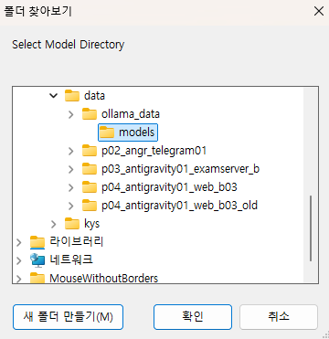

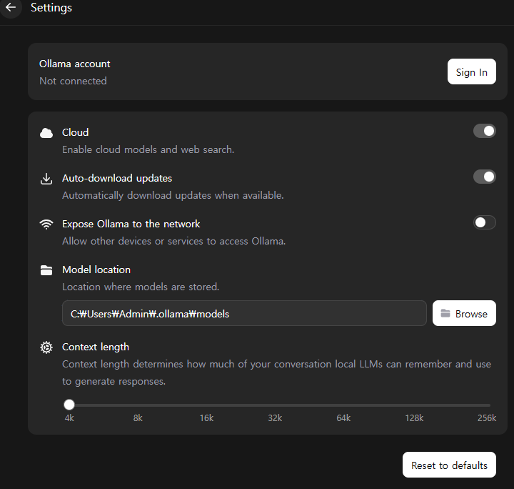

설치 방법
1. Ollama 공식 웹사이트에 접속하여 프로그램을 다운로드합니다.

2. 설치 완료 후, 원하는 모델을 다운로드합니다.

3. (선택 사항) 모델 저장 위치를 설정할 수 있습니다.

4. (선택 사항) 컨텍스트(Context) 설정을 조정합니다. 일반적인 대화의 경우 4K 토큰으로도 충분합니다.

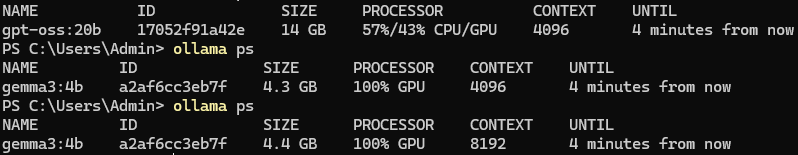

5. 주의: 모델의 파라미터 수를 보유한 VRAM 용량을 초과하면 성능이 저하될 수 있으니 참고하시기 바랍니다.

### [프로그래밍] PYTHON과 JS 의 FOR 비교

```javascript
for (let i = 0; i < 5; i++) {
     console.log(i);
    }
```
```py
for i in range(5):
    print(i)

```

# Chapter3. 노트(FE)
## 웹 기술 개요
- 웹 기술은 정형, 반정형, 비정형 데이터 처리를 기반으로 합니다. HTML, CSS, JavaScript는 웹 페이지의 구조, 스타일, 기능을 담당하는 핵심 기술입니다. React, Vue.js 등은 SPA(Single Page Application) 구축에 사용되며, jQuery는 편의성을 제공하지만 성능에 영향을 줄 수 있습니다.

## 데이터 종류
- 정형 데이터: SQL, Excel, Access 등. 처리 속도가 빠릅니다.
- 반정형 데이터: NoSQL, HTML 등.
- 비정형 데이터: 그림, 사진, 영상, 음악 등.

## 주요 웹 기술
- HTML: 웹 페이지의 구조를 정의합니다.
- CSS: 웹 페이지의 스타일을 꾸밉니다.
- JavaScript: 웹 페이지에 동적인 기능을 추가합니다. (Chrome V8 엔진)
- Node.js: JavaScript를 서버 측에서도 실행할 수 있게 합니다. (V8 엔진)
- React, Vue.js: SPA(Single Page Application) 구축에 사용됩니다.
- jQuery: JavaScript를 쉽게 사용할 수 있도록 돕지만, 때로는 속도 저하의 원인이 될 수 있습니다.
  
## 웹 기초
- HTML: 정보 전달의 역할을 하며, <html> 태그로 시작하여 </html> 태그로 끝맺습니다.
    - 예시: <a href="#">네이버</a>
- CSS: 웹 페이지의 시각적인 스타일을 담당합니다.
- JavaScript: 웹 페이지에 상호작용과 동적인 기능을 구현합니다.
특징: HTML에서 띄어쓰기는 한 칸만 인식하며, 엔터는 무시됩니다.

## 프론트엔드 학습: HTML, CSS, JavaScript 순차적 이해

### 개요
- 프론트엔드 개발은 웹사이트나 웹 애플리케이션의 사용자 인터페이스(UI)와 사용자 경험(UX)을 구축하는 분야입니다. 이를 위해 웹을 구성하는 세 가지 핵심 기술인 HTML, CSS, JavaScript를 순차적으로 이해하는 것이 중요합니다. HTML은 웹 페이지의 뼈대를, CSS는 디자인과 레이아웃을, JavaScript는 동적인 기능을 담당합니다. 이 세 가지 기술을 단계별로 학습함으로써 웹 개발의 기초를 탄탄히 다질 수 있습니다.

- HTML (HyperText Markup Language)


### 정의
- HTML은 웹 페이지의 구조와 내용을 정의하는 마크업 언어입니다. <h1>, <p>, <a> 와 같은 태그들을 사용하여 텍스트, 이미지, 링크 등 다양한 콘텐츠를 웹 브라우저에 표시합니다. HTML은 웹 페이지의 기본 골격을 형성하며, 검색 엔진 최적화(SEO)와 웹 접근성에 매우 중요한 역할을 합니다.

### 주요 내용
- 기본 구조: <!DOCTYPE html>, <html>, <head>, <body> 태그로 구성됩니다.
- 메타 정보: <meta> 태그를 사용하여 문자 인코딩, 뷰포트 설정 등 웹 페이지의 부가 정보를 정의합니다.
- 콘텐츠 태그: 제목(<h1>~<h6>), 단락(<p>), 목록(<ul>, <ol>, <li>), 링크(<a>), 이미지(), 표(<table>) 등 다양한 태그를 활용하여 콘텐츠를 구성합니다.
- 시맨틱 태그: <header>, <nav>, <main>, <article>, <footer> 등 의미론적인 태그를 사용하여 웹 페이지 구조를 더욱 명확하게 정의합니다.

### 예시
```html
<!DOCTYPE html>
<html>
<head>
    <title>HTML 예제</title>
</head>
<body>
    <h1>안녕하세요!</h1>
    <p>이것은 HTML 예제입니다.</p>
    <a href="https://www.google.com">구글로 이동</a>
</body>
</html>
```

### CSS (Cascading Style Sheets)


### 정의
- CSS는 HTML로 작성된 웹 페이지의 디자인과 레이아웃을 꾸미는 스타일 시트 언어입니다. 색상, 글꼴, 간격, 정렬 등을 조절하여 시각적으로 매력적인 웹 페이지를 만듭니다. CSS는 HTML 요소에 스타일을 적용하는 규칙의 모음입니다.

### 주요 내용
- 선택자 (Selectors): HTML 요소를 선택하여 스타일을 적용합니다. 태그 선택자, 클래스 선택자(.), ID 선택자(#) 등이 있습니다.
- 속성 (Properties): 적용할 스타일의 종류를 지정합니다. (예: color, font-size, margin, padding, background-color)
- 값 (Values): 속성에 적용될 구체적인 값을 지정합니다. (예: blue, 16px, 10px, yellow)
- 레이아웃: display (flexbox, grid), position, float 등을 사용하여 요소들의 배치와 정렬을 제어합니다.
- 반응형 디자인: 미디어 쿼리(@media)를 사용하여 다양한 화면 크기에 맞게 스타일을 조정합니다.

### 예시 
```CSS
h1 {
    color: blue;
    text-align: center;
}
p {
    font-size: 16px;
    line-height: 1.5;
}
```

### JavaScript (JS)
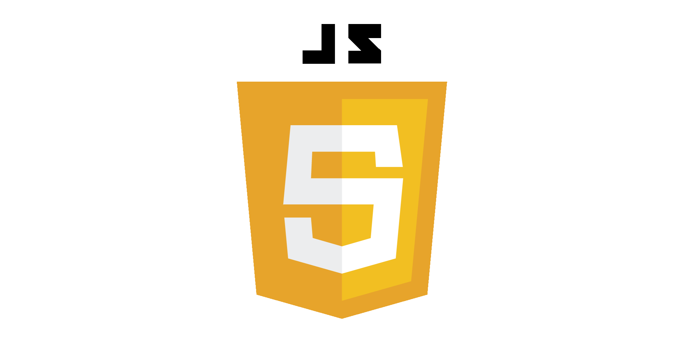

### 정의
- JavaScript는 웹 브라우저에서 실행되는 프로그래밍 언어로, 웹 페이지에 동적인 기능과 상호작용을 추가하는 데 사용됩니다. 사용자의 입력에 반응하거나, 데이터를 실시간으로 업데이트하거나, 애니메이션 효과를 구현하는 등 웹 페이지를 더욱 생동감 있게 만듭니다.

### 주요 내용
- 변수와 데이터 타입: let, const를 사용하여 변수를 선언하고, 문자열, 숫자, 불리언, 배열, 객체 등 다양한 데이터 타입을 다룹니다.
- 연산자: 산술, 비교, 논리 연산자 등을 사용하여 데이터를 처리하고 조건을 제어합니다.
- 제어문: if/else, switch 문으로 조건에 따라 다른 코드를 실행하고, for, while 루프로 반복 작업을 수행합니다.
- 함수: 코드 블록을 재사용 가능하게 만들고, 특정 기능을 수행하는 함수를 정의합니다.
- DOM (Document Object Model) 조작: JavaScript를 사용하여 HTML 요소를 선택하고, 내용을 변경하거나, 이벤트를 처리하는 등 웹 페이지와 상호작용합니다.
- 이벤트 처리: 사용자 클릭, 키보드 입력 등 다양한 이벤트를 감지하고 이에 반응하는 코드를 작성합니다.

### 예시
```JAVASCRIPT
function greet() {
    alert("안녕하세요! JavaScript 학습을 환영합니다.");
}
greet(); // 함수 호출
```

### 정리
- HTML, CSS, JavaScript는 프론트엔드 개발의 필수적인 삼총사입니다. HTML로 구조를 잡고, CSS로 디자인을 입히고, JavaScript로 생동감을 불어넣는 과정을 이해하는 것은 웹 개발의 첫걸음입니다. 각 기술의 역할을 명확히 인지하고 순차적으로 학습해 나가는 것이 중요합니다. 이 세 가지 기술의 조화로운 활용을 통해 사용자는 더욱 풍부하고 인터랙티브한 웹 경험을 할 수 있습니다.

## JavaScript의 'this' 키워드: 함수별 동작 방식 비교

### 개요
JavaScript에서 `this` 키워드는 현재 실행 컨텍스트에 따라 다르게 바인딩되는 동적인 특성을 가지고 있습니다. 특히 일반 함수와 화살표 함수에서의 `this` 바인딩 방식은 큰 차이를 보이므로, 이를 명확히 이해하는 것이 중요합니다.

### 주요 내용

### 1. 일반 함수의 `this` 바인딩

일반 함수(function declaration, function expression)에서 `this`는 함수가 **어떻게 호출되었는지**에 따라 결정됩니다.

*   **전역 컨텍스트**: 전역 스코프에서 호출될 경우, 브라우저 환경에서는 `window` 객체에 바인딩됩니다. Node.js 환경에서는 `global` 객체에 바인딩됩니다. (엄격 모드에서는 `undefined`)
*   **객체의 메서드**: 객체의 속성으로 호출될 경우, 해당 객체에 바인딩됩니다.
*   **콜백 함수**: 콜백 함수로 전달될 경우, 호출 방식에 따라 `this`가 달라집니다. 전역 객체나 `undefined`에 바인딩될 가능성이 높습니다.
*   **`call()`, `apply()`, `bind()`**: 명시적으로 `this` 값을 지정하여 호출할 수 있습니다.

#### 예시 1: 일반 함수와 `this`

```javascript
// 1. 전역 컨텍스트 (브라우저 환경)
console.log(this === window); // true (일반적으로)

function showThisGlobal() {
  console.log(this === window); // true (일반적으로)
}
showThisGlobal();

// 2. 객체의 메서드
const person = {
  name: "Alice",
  greet: function() {
    console.log(`Hello, my name is ${this.name}`); // 'this'는 person 객체를 가리킴
  }
};
person.greet(); // "Hello, my name is Alice"

// 3. 콜백 함수 (주의 필요)
const counter = {
  count: 0,
  increment: function() {
    setTimeout(function() {
      // 여기서 'this'는 window 객체(또는 undefined)를 가리킴!
      console.log(this.count); // undefined (또는 에러)
    }, 100);
  }
};
counter.increment();

// 4. call, apply, bind 사용
function sayHello(greeting) {
  console.log(`${greeting}, ${this.name}`);
}

const obj1 = { name: "Bob" };
sayHello.call(obj1, "Hi");      // "Hi, Bob"
sayHello.apply(obj1, ["Hello"]); // "Hello, Bob"

const boundSayHello = sayHello.bind(obj1);
boundSayHello("Good morning"); // "Good morning, Bob"
```

### 2. 화살표 함수의 `this` 바인딩

화살표 함수(arrow function)는 `this` 바인딩 방식이 일반 함수와 근본적으로 다릅니다.

*   **Lexical Scoping**: 화살표 함수는 자신의 `this`를 가지지 않습니다. 대신, **자신이 선언될 당시의 외부 스코프의 `this`를 그대로 상속받습니다.** (Lexical `this`)
*   **`call()`, `apply()`, `bind()` 무시**: 화살표 함수는 `call`, `apply`, `bind` 메서드를 사용하여 `this` 값을 변경할 수 없습니다. `this` 값은 항상 자신이 선언된 스코프를 따릅니다.

#### 예시 2: 화살표 함수와 `this`

```javascript
// 1. 전역 컨텍스트 (브라우저 환경)
const showThisArrowGlobal = () => {
  console.log(this === window); // true (일반적으로, 화살표 함수는 외부 스코프의 this를 따름)
};
showThisArrowGlobal();

// 2. 객체의 메서드 내에서 사용
const personArrow = {
  name: "Charlie",
  greet: function() {
    // 일반 함수 안에서 화살표 함수를 사용
    setTimeout(() => {
      // 여기서 'this'는 greet 메서드의 'this' (personArrow 객체)를 상속받음!
      console.log(`Hello, my name is ${this.name}`);
    }, 100);
  }
};
personArrow.greet(); // "Hello, my name is Charlie"

// 3. call, apply, bind 무시
function regularFunc(a) {
  this.val = a;
}
const arrowFunc = (a) => {
  this.val = a;
};

const obj2 = {};

regularFunc.call(obj2, 10);
console.log(obj2.val); // 10

arrowFunc.call(obj2, 20); // obj2의 'this'는 변경되지 않음 (window를 가리킴)
console.log(obj2.val);    // undefined
console.log(window.val);  // 20 (브라우저 환경)
```

### 3. `this` 관련 주의 사항 및 팁

*   **엄격 모드 (`'use strict';`)**: 엄격 모드에서는 일반 함수의 `this`가 `undefined`로 바인딩되어, 의도치 않은 전역 변수 생성을 방지합니다.
*   **`bind()` 활용**: 일반 함수에서 `this`가 제대로 바인딩되지 않는 콜백 함수 등의 문제 해결에 `bind()`를 사용하는 것이 일반적입니다.
*   **화살표 함수 활용**: 객체 메서드 내부에서 비동기 작업(setTimeout, 이벤트 리스너 등)을 처리할 때 `this` 컨텍스트 유지가 필요하면 화살표 함수를 사용하는 것이 매우 편리하고 코드를 간결하게 만듭니다.

## 정리

*   **일반 함수**: `this`는 **호출 방식**에 따라 결정 (동적 바인딩).
*   **화살표 함수**: `this`는 **선언 시점의 외부 스코프**를 그대로 상속받음 (정적, Lexical 바인딩).

이 두 가지 `this` 바인딩 방식을 명확히 구분하여 사용하는 것이 JavaScript 코드의 안정성과 가독성을 높이는 데 중요합니다.


## [Html] 이스케이프 문자

| 문자 | HTML 코드 | 설명 | 화면 출력 |
|-----|-----------|------|-----------|
| `<` | `&lt;` | 태그 시작 문자 | < |
| `>` | `&gt;` | 태그 끝 문자 | > |
| `&` | `&amp;` | 엔티티 시작 문자 | & |
| `"` | `&quot;` | 큰따옴표 | " |
| `'` | `&#39;` | 작은따옴표 | ' |
| 공백 | `&nbsp;` | 줄바꿈 없이 유지되는 공백 | (space) |
| © | `&copy;` | 저작권 표시 | © |
| ® | `&reg;` | 등록상표 | ® |
| ™ | `&trade;` | 상표 | ™ |

### [CSS] 선택자 순위표

| 선택자 종류 (Selector Type) | 우선순위 점수 | 기호 및 예시 | 설명 |
| :--- | :--- | :--- | :--- |
| **`!important`** | **최우선** | `color: red !important;` | 점수 체계를 무시하고 무조건 가장 높은 우선순위 적용 |
| **인라인 스타일 (Inline)** | **1000점** | `<div style="...">` | HTML 태그 내부에 직접 `style` 속성 작성 |
| **아이디 (ID)** | **100점** | `#header`, `#logo` | HTML의 `id` 속성을 타겟으로 하는 선택자 |
| **클래스 (Class)**<br>가상 클래스<br>속성 (Attribute) | **10점** | `.container`<br>`:hover`<br>`[type="text"]` | 클래스 이름, 상태를 나타내는 가상 클래스, 특정 속성 선택 |
| **태그 (Element)**<br>가상 요소 | **1점** | `div`, `p`<br>`::before` | HTML 태그 이름이나 요소의 특정 부분을 선택 |
| **전체 (Universal)**<br>결합자<br>부정 가상 클래스 | **0점** | `*`<br>`>`, `+`, `~`<br>`:not()` | 모든 요소나 관계 표현 (`:not()` 내부는 자체 점수 가짐) |


동일한 등급일 때
아래쪽 값이 덮어쓴다.
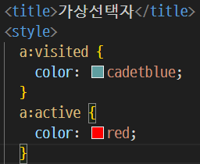

## [CSS] 몇가지 정리

### 부모에게 flex 해야 자식이 정렬됨
display : flex;


### position 
relative : 단독
absolute : position 또는 body에 의존
sticky : xtop 또는 bottom 위치 에 의존
fixted : 원하는 위치에 그냥 고정


### transition 효과들
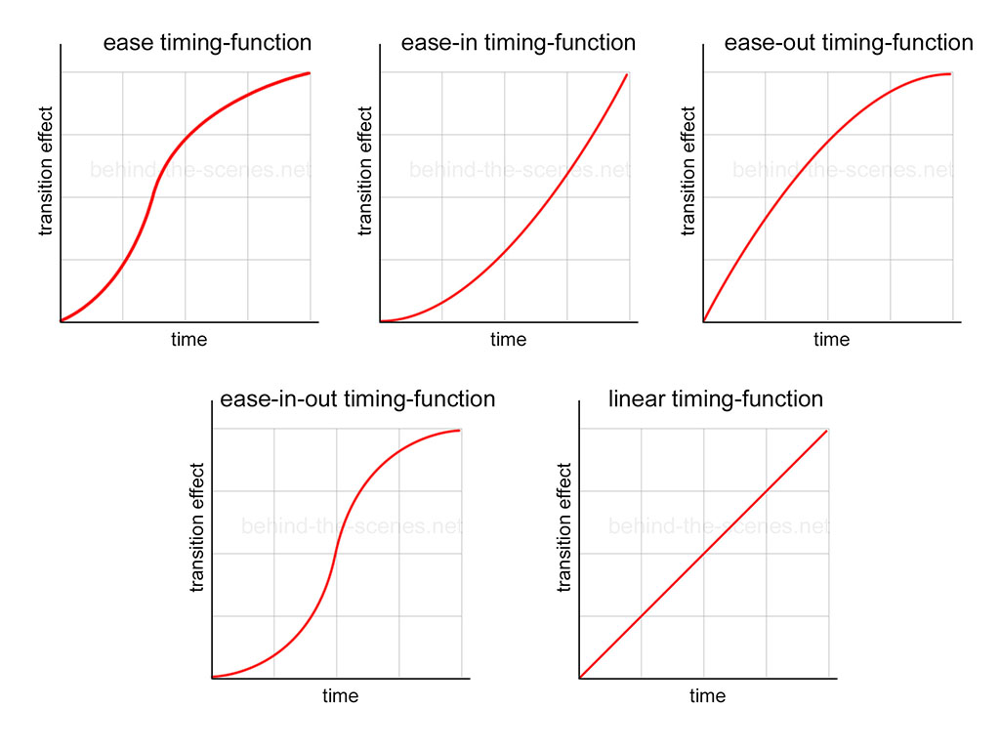

##
: -> 가상 클래스 선택자
:: -> 가상 요소 선택자

##  축약형 요약
**사각형**
   - 4가지: 위부터 시계방향(위, 오른, 아래, 왼)
   - 2가지: 위 + 아래, 좌 + 우
   - 1가지: 전부
   >margin: 10px
   >margin: 20px 40px
   >margin: 20px 20px 20px 20px 
   >margin-top: 위 한곳
   >margin-bottom: 아래 한곳
-----------------
**대각선**
  - 4가지: 위부터 시계방향(왼위 , 오른위, 오른아래, 왼아래)
  - 2가지: 왼위 + 대각선,  오른위 + 대각선
  - 1가지: 전부
  >border-radius : 10px 10px 20px 20px


## [CSS]Flex box 정리

```html
<!DOCTYPE html>
<html lang="en">
  <head>
    <meta charset="UTF-8" />
    <meta name="viewport" content="width=device-width, initial-scale=1.0" />
    <title>Document</title>
    <style>
      body {
        margin: 0;
        padding: 30px;
        background-color: rgb(255, 240, 222);
      }
      .container {
        display: flex;
        gap: 10px;
        background-color: #ddd;
        padding: 20px;
        border-radius: 10px;
        margin-bottom: 40px;
      }
      .box {
        height: 80px;
        display: flex;
        justify-content: center;
        align-items: center;
        min-width: 0;
        border-radius: 8px;
        color: white;
        font-weight: bold;
      }
      .box1 {
        background-color: rgb(73, 159, 217);
      }
      .box2 {
        background-color: rgb(40, 145, 55);
      }
      .box3 {
        background-color: rgb(200, 139, 40);
      }
      .container:first-of-type .box1 {
        flex: 1 1 0;
      }
      .container:first-of-type .box2 {
        flex: 2 1 0;
      }
      .container:first-of-type .box3 {
        flex: 3 1 0;
      }

      .container:nth-of-type(2) .box1 {
        flex: 0 1 300px;
      }
      .container:nth-of-type(2) .box2 {
        flex: 0 2 300px;
      }
      .container:nth-of-type(2) .box3 {
        flex: 0 3 300px;
      }

      .container:last-of-type .box1 {
        flex: 0 1 100px;
      }
      .container:last-of-type .box2 {
        flex: 0 1 200px;
      }
      .container:last-of-type .box3 {
        flex: 0 1 300px;
      }
    </style>
  </head>
  <body>
    <!-- (h2{$ flex 비교}+div.container>div.box.box$*3)*3 -->
    <h2>1. flex-grow 비교</h2>
    <div class="container">
      <div class="box box1">grow: 1</div>
      <div class="box box2">grow: 2</div>
      <div class="box box3">grow: 3</div>
    </div>
    <h2>2. flex-shrink 비교</h2>
    <div class="container">
      <div class="box box1">shrink: 1</div>
      <div class="box box2">shrink: 2</div>
      <div class="box box3">shrink: 3</div>
    </div>
    <h2>3. flex-basis 비교</h2>
    <div class="container">
      <div class="box box1">basis: 100px</div>
      <div class="box box2">basis: 200px</div>
      <div class="box box3">basis: 300px</div>
    </div>
  </body>
</html>


```
```html
<!DOCTYPE html>
<html lang="en">
  <head>
    <meta charset="UTF-8" />
    <meta name="viewport" content="width=device-width, initial-scale=1.0" />
    <title>Document</title>
    <style>
      body {
        margin: 0;
        padding: 30px;
        background-color: rgb(255, 240, 222);
      }
      .container {
        display: flex;
        gap: 10px;
        background-color: #ddd;
        padding: 20px;
        border-radius: 10px;
        margin-bottom: 40px;
      }
      .box {
        height: 80px;
        display: flex;
        justify-content: center;
        align-items: center;
        min-width: 0;
        border-radius: 8px;
        color: white;
        font-weight: bold;
      }
      .box1 {
        background-color: rgb(73, 159, 217);
      }
      .box2 {
        background-color: rgb(40, 145, 55);
      }
      .box3 {
        background-color: rgb(200, 139, 40);
      }
      .container:first-of-type .box1 {
        flex: 1 1 0;
      }
      .container:first-of-type .box2 {
        flex: 2 1 0;
      }
      .container:first-of-type .box3 {
        flex: 3 1 0;
      }

      .container:last-of-type .box1 {
        flex: 1 1 100px;
      }
      .container:last-of-type .box2 {
        flex: 2 1 100px;
      }
      .container:last-of-type .box3 {
        flex: 3 1 100px;
      }
    </style>
  </head>
  <body>
    <!-- (h2{$ flex 비교}+div.container>div.box.box$*3)*3 -->
    <h2>1. flex-basis: 0px (grow 비율만 적용)</h2>
    <div class="container">
      <div class="box box1">grow: 1</div>
      <div class="box box2">grow: 2</div>
      <div class="box box3">grow: 3</div>
    </div>
    <h2>2. flex-basis: 100px (basis 와 grow 함께 적용)</h2>
    <div class="container">
      <div class="box box1">basis+grow: 100px</div>
      <div class="box box2">basis+grow: 100px</div>
      <div class="box box3">basis+grow: 100px</div>
    </div>
  </body>
</html>
```

## [CSS]GRID

```html
<!DOCTYPE html>
<html lang="en">
  <head>
    <meta charset="UTF-8" />
    <meta name="viewport" content="width=device-width, initial-scale=1.0" />
    <title>Grid 레이아웃</title>
    <style>
      :root {
        --myb1: rgb(124, 124, 214);
        --myb2: rgb(183, 183, 245);
        --myb3: rgb(218, 218, 243);
        --myg1: rgb(110, 196, 132);
        --myg2: rgb(174, 240, 190);
        --myg3: rgb(255, 255, 255);
        --myr1: rgb(252, 114, 114);
        --myr2: rgb(240, 174, 174);
        --myr3: rgb(236, 210, 210);
      }
      div {
        margin: 3px;
        border: 2px solid #999;
        box-shadow: 5px 5px 10px rgba(0, 0, 0, 0.5);
      }
      .wrap {
        display: grid;
        grid-template-columns: 1fr 2fr 1fr;
        grid-template-rows: 100px 200px 100px;
      }
      #grid1 {
        background-color: var(--myb1);
        grid-column-start: 1;
        grid-column-end: 3;
        /* grid-row-start: 1; */
        /* grid-row-end: 2; */
      }
      #grid2 {
        background-color: var(--myb2);
        grid-column-start: 3;
        grid-column-end: 4;
        /* grid-row-start: 1; */
        /* grid-row-end: 2; */
      }
      #grid3 {
        background-color: var(--myg1);
        grid-column-start: 1;
        grid-column-end: 2;
        grid-row-start: 2;
        grid-row-end: 4;
      }
      #grid4 {
        background-color: var(--myg2);
        grid-column-start: 2;
        grid-column-end: 4;
      }
      #grid5 {
        background-color: var(--myr1);
        grid-column-start: 2;
        grid-column-end: 3;
      }
      #grid6 {
        background-color: var(--myr2);
        grid-column-start: 3;
        grid-column-end: 4;
      }
    </style>
  </head>
  <body>
    <!-- div.wrap>div#grid${GRID$}*6 -->
    <div class="wrap">
      <div id="grid1">GRID1</div>
      <div id="grid2">GRID2</div>
      <div id="grid3">GRID3</div>
      <div id="grid4">GRID4</div>
      <div id="grid5">GRID5</div>
      <div id="grid6">GRID6</div>
    </div>
  </body>
</html>
```

## [JS] 데이터 타입변환

```javascript
let num = 123
let str = "456"
let bit = true
console.log("============ Note ============")
console.log(`${typeof(num)} 타입 ${num}의 자료형을 변환하면`)
console.log(String(num), typeof String(num))
console.log(Boolean(num), typeof Boolean(num))
console.log(`${typeof(str)} 타입 ${str}의 자료형을 변환하면`)
console.log(Number(str), typeof Number(str))
console.log(Boolean(str), typeof Boolean(str))
console.log(`${typeof(bit)} 타입 ${bit}의 자료형을 변환하면`)
console.log(String(bit), typeof String(bit))
console.log(Number(bit), typeof Number(bit))
console.log("============ Test ============")
console.log("num + str:",num + str, typeof(num+str))
console.log("num + bit:",num + bit, typeof(num+bit))
console.log("bit + str",bit + str, typeof(bit+str))
console.log("============ Tip ============")
console.log('num+"":',num+"",typeof(num+""))
console.log('!!num:',!!num,typeof(!!num))
console.log('str*1:',str*1,typeof(str*1))
console.log('+str:',+str,typeof(+str))
console.log('!!str:',!!str,typeof(!!str))
console.log('bit+"":',bit+"",typeof(bit+""))
console.log('bit*1:',bit*1,typeof(bit*1))
console.log('+bit:',+bit,typeof(+bit))
```

## [JS] null과 undefined의 차이
null과 undefined는 JavaScript에서 값의 부재를 나타내지만, 그 의미와 발생 방식에 차이가 있습니다.

undefined는 변수에 값이 할당되지 않았거나, 존재하지 않는 객체의 속성에 접근하려고 할 때 자동으로 발생하는 값입니다. 이는 값이 아직 정해지지 않았거나, 실수로 할당되지 않았을 가능성을 내포합니다.

반면에 null은 개발자가 의도적으로 '값이 없음'을 명시적으로 표현할 때 사용됩니다. 즉, 어떤 값이 존재하지 않는다는 것이 확정된 상태를 의미합니다.

이를 화장실 휴지에 비유하자면, undefined는 화장실에 들어갔는데 휴지가 아예 있는지 없는지도 알 수 없는 상태입니다. 휴지걸이 자체도 보이지 않아 존재 여부조차 불분명합니다. 반면 null은 휴지걸이는 보이지만, 휴지는 비어 있어 '값이 없음'이 명확히 확인된 상태입니다.

```JAVASCRIPT
// NaN 값을 확인하려면 함수를 사용해야 합니다.
console.log(Number.isNaN(test)); // NaN 값을 확인하려면 함수 사용
console.log(NaN === NaN); // 숫자 타입이지만, 숫자로 표현되지 않습니다.

console.log("undefined == undefined", undefined == undefined); // true
console.log("undefined === undefined", undefined === undefined); // true
console.log("null == null", null == null); // true
console.log("null === null", null === null); // true
console.log("null == undefined", null == undefined); // true (타입은 다르지만 값이 같다고 판단)
console.log("null === undefined", null === undefined); // false (타입이 다르므로 같지 않다고 판단)

// undefined: 값이 아직 할당되지 않았거나, 실수일 가능성이 있습니다.
// null: 값이 '없음'이 명확하게 확정된 상태이며, 의도적으로 부여됩니다.

/*
화장실에 갔을 때 휴지에 비유하자면,
어떤 화장실에 들어갔는데 휴지가 없어서 벽을 봤더니 휴지걸이도 없고, 올려놓는 곳도 없고.. 아예 있는지도 없는지도 모르는 상태지만 (undefined)
휴지걸이는 보이기는 하고, 그런데 휴지가 없어 보이고, 그래서 휴지심만 남아서 비어있는 상태라는 것이 확인이 되는 상태 (null)
*/
```

## [JS] Array와 Object 기법

```javascript
/* 참조복사 */
const arr = [11, 22, 33, 44, 55];
const arr2 = arr;
arr2[2] = 1004;
console.log(arr, arr2);
console.log(arr == arr2);
console.log(arr === arr2);

/* 옅은복사 */
const srr = [66, 77, 88, 99, 0];
const drr = [...srr];
drr[2] = 1004;
console.log(srr, drr);
console.log(srr == drr);
console.log(srr === drr);

console.log(Math.max(11, 22, 33, 44, 55, 66, 77, 88));
console.log(Math.max(arr)); // NaN
console.log(Math.max(...arr));
console.log(Math.min(...arr));

```
```javascript
function fn(...arr) {
  // 나머지 매개변수 ; py: (*args)
  console.log(arr, typeof arr, Array.isArray(arr));
  console.log(...arr); // 전개연산자 ; py: fn[:]
}
fn(1, 2, 3, 4, 5, 6);
```
```javascript
const a = [1, 2];
const b = [3, 4];
const c = a + b;
const result = [...a, ...b];
console.log(c);
console.log(result);
console.log(typeof c, Array.isArray(c));
console.log(typeof result, Array.isArray(result));
```
```javascript
/* object, 객체 다루기 */
const user = { name: "홍길동", age: 10 };
// 객체의 키로 값을 읽는법 - R
console.log(user.name);
console.log(user["name"]);
// 객체에 키값쌍을 추가하는 법 - C
const 변수 = "address";
user.gender = "male";
user[변수] = "대한민국";
console.log(user);
// 객체의 키값쌍을 수정하는법 - U
user[변수] = "대한민국 부산광역시";
// 키값쌍을 삭제하는 법 - D
delete user.gender;
delete user[변수];
delete user["age"];
console.log(user);

/* Tip */
const ok = "학교";
const test = { ok }; // {ok : ok}
console.log(test);

const obj = { t1: 11, t2: 22, t3: 33, t4: 44 };
const updated = { ...obj, t4: 44 };
console.log(updated);
```

## [웹] Modal 창 이해하기: 개념, 활용, 면접 예상 질문

### 개요
Modal 창(모달 창)은 웹 애플리케이션에서 현재 작업 흐름을 일시 중단하고 사용자에게 중요한 정보나 추가적인 입력을 요구할 때 사용하는 팝업 창입니다. 사용자 인터페이스(UI) 디자인에서 사용자 경험(UX)을 향상시키는 데 중요한 역할을 합니다.

### Modal 창이란?

Modal 창은 기본적으로 사용자 인터페이스의 일부로, 특정 작업이 완료되거나 사용자가 명확한 의사결정을 내리기 전까지는 배경 화면과의 상호작용을 차단합니다. 이는 사용자가 현재 보고 있는 콘텐츠에 집중하도록 유도하고, 필수적인 정보를 놓치지 않도록 돕는 효과가 있습니다.

### 주요 특징

*   **차단(Blocking)**: Modal 창이 열려 있는 동안에는 기본 페이지와의 상호작용이 제한됩니다. 배경을 클릭해도 아무런 반응이 없거나, Modal 창을 닫아야만 상호작용이 가능하게 됩니다.
*   **강제성**: 사용자는 Modal 창의 내용을 확인하고, 버튼(확인, 취소, 닫기 등)을 클릭하여 닫거나 특정 액션을 수행해야만 이전 단계로 돌아갈 수 있습니다.
*   **중앙 집중**: 일반적으로 화면 중앙에 위치하여 사용자의 시선을 사로잡습니다.

### Modal 창의 활용 사례

Modal 창은 다양한 상황에서 유용하게 사용될 수 있습니다.

### 1. 정보 확인 및 알림

*   **경고 메시지**: 삭제, 저장 등 중요한 작업을 수행하기 전에 사용자에게 경고하거나 최종 확인을 요청할 때 사용됩니다. (예: "정말 삭제하시겠습니까?")
*   **성공/실패 알림**: 작업 완료 후 성공 또는 실패 메시지를 표시합니다.
*   **뉴스레터 구독**: 웹사이트 방문 시 뉴스레터 구독 팝업으로 활용됩니다.

### 2. 데이터 입력 및 수정

*   **로그인/회원가입**: 사용자 인증을 위한 폼을 Modal 창으로 제공할 수 있습니다.
*   **설정 변경**: 사용자가 특정 설정을 변경할 수 있는 폼을 Modal 창으로 띄울 수 있습니다.
*   **간단한 폼 작성**: 회원 정보 수정, 문의하기 등 비교적 간단한 폼 입력을 Modal 창에서 처리합니다.

### 3. 기타 활용

*   **이미지 뷰어**: 작은 썸네일을 클릭했을 때 원본 이미지를 Modal 창으로 크게 보여줍니다.
*   **외부 콘텐츠 로딩**: 동영상 플레이어, 지도 정보 등을 Modal 창 안에 표시합니다.

## Modal 창 구현 시 주의점

Modal 창을 효과적으로 사용하기 위해서는 몇 가지 고려해야 할 사항이 있습니다.

### 1. 접근성 (Accessibility)

*   **키보드 탐색**: Modal 창이 열리면 키보드 포커스가 Modal 창 안으로 이동해야 하며, Modal 창 밖으로 나가지 않도록 제어해야 합니다. (Tab 키, Shift+Tab 키 등)
*   **스크린 리더**: 스크린 리더 사용자를 위해 Modal 창이 열렸음을 알리고, 내용이 명확하게 전달될 수 있도록 ARIA 속성(`role='dialog'`, `aria-modal='true'`, `aria-labelledby` 등)을 적절히 사용해야 합니다.
*   **화면 낭독**: Modal 창 외의 배경 영역은 스크린 리더가 읽지 않도록 `aria-hidden='true'` 등으로 숨겨주는 것이 좋습니다.

### 2. 사용자 경험 (UX)

*   **과도한 사용 금지**: 너무 많은 Modal 창이 연속적으로 나타나거나, 불필요한 정보에 대해 Modal 창을 띄우는 것은 사용자 경험을 해칩니다. 꼭 필요한 상황에만 사용해야 합니다.
*   **크기 및 반응형 디자인**: 다양한 화면 크기(데스크톱, 태블릿, 모바일)에서 Modal 창이 적절하게 보이도록 반응형 디자인을 적용해야 합니다.
*   **닫기 버튼의 명확성**: 사용자가 Modal 창을 쉽게 닫을 수 있도록 명확한 '닫기(X)' 버튼을 제공해야 합니다.
*   **데이터 유지**: 사용자가 Modal 창에서 입력한 내용이 실수로 닫혀도 유지될 수 있도록 하는 것이 좋습니다.

### 3. 성능

*   **콘텐츠 로딩**: Modal 창 내부에 많은 양의 콘텐츠나 복잡한 요소를 로딩하면 페이지 성능에 영향을 줄 수 있습니다. 필요한 최소한의 정보만 로드하거나, 비동기적으로 로딩하는 방식을 고려해야 합니다.

## 면접 예상 질문 및 시나리오

### 질문 1: Modal 창과 일반 팝업 창의 차이점은 무엇인가요?

**답변 시나리오**: 
*   **핵심 차이**: Modal 창은 **차단(blocking)** 메커니즘이 있다는 점이 가장 큰 차이입니다. 일반 팝업(window.open 등)은 별도의 창으로 열리며 기존 창과의 상호작용을 제한하지 않습니다. Modal 창은 사용자가 현재 작업에 집중하도록 강제하며, 배경과의 상호작용을 막습니다.
*   **목적**: Modal은 **필수적인 정보 제공/입력**에, 일반 팝업은 **추가 정보 제공, 광고, 외부 링크** 등에 주로 사용될 수 있습니다. (물론 요즘은 `window.open`으로 새 탭/창을 여는 경우가 많아졌습니다.)
*   **기술적 구현**: Modal 창은 주로 DOM 조작(div 요소 생성, CSS 스타일링, z-index 조절)으로 구현되는 반면, 일반 팝업은 브라우저의 `window.open` API를 사용합니다.

### 질문 2: 웹 페이지에서 Modal 창의 접근성을 어떻게 보장할 수 있을까요?

**답변 시나리오**: 
*   **키보드 포커스 관리**: `tabindex`와 JavaScript를 이용해 포커스가 Modal 창 내부로만 제한되도록 합니다. `ESC` 키로 닫는 기능도 고려합니다.
*   **ARIA 역할 부여**: `role='dialog'`, `aria-modal='true'`를 사용하여 스크린 리더에게 Modal 창임을 알립니다. `aria-labelledby` 또는 `aria-label`로 Modal 창의 제목을 제공합니다.
*   **배경 콘텐츠 숨김**: Modal 창이 활성화될 때 배경 콘텐츠는 `aria-hidden='true'`로 숨겨 스크린 리더가 혼동하지 않도록 합니다.
*   **화면 낭독기 최적화**: Modal 창이 열릴 때 화면 낭독기가 자동으로 내용을 읽어주도록 유도하는 것이 좋습니다.

### 질문 3: JavaScript로 Modal 창을 직접 구현한다면 어떤 방식으로 접근하시겠습니까? (간단한 코드 예시 포함)

**답변 시나리오**: 
1.  **HTML 구조**: Modal 창을 구성할 `div` 요소를 만들고, 배경(`modal-backdrop`)과 내용(`modal-content`)으로 나눕니다. 닫기 버튼(`modal-close`)도 포함합니다.
2.  **CSS 스타일링**: `modal-backdrop`은 `position: fixed`, `top: 0`, `left: 0`, `width: 100%`, `height: 100%`, `background-color: rgba(0, 0, 0, 0.5)`, `z-index: 1000` 등으로 설정합니다. `modal-content`는 중앙 정렬, 배경색, 그림자 등을 적용합니다. 초기에는 `display: none;`으로 숨깁니다.
3.  **JavaScript 로직**: 
    *   Modal을 열 버튼에 `click` 이벤트 리스너를 추가하여 Modal 요소와 배경 요소를 보이게(`display: block;` 또는 `display: flex;`) 하고, `z-index`를 조정합니다.
    *   닫기 버튼(`modal-close`)과 배경(`modal-backdrop`)에 `click` 이벤트 리스너를 추가하여 Modal과 배경을 숨깁니다.
    *   `ESC` 키 이벤트 리스너를 추가하여 Modal을 닫는 기능을 구현합니다.
    *   (고급) 포커스 관리 및 ARIA 속성 동적 변경 로직을 추가합니다.

```javascript
// 예시 JavaScript (간략화)
const openModalBtn = document.getElementById('openModal');
const closeModalBtn = document.getElementById('closeModal');
const modalOverlay = document.getElementById('modalOverlay');
const modal = document.getElementById('myModal');

openModalBtn.addEventListener('click', () => {
  modalOverlay.style.display = 'block';
  modal.style.display = 'block';
});

closeModalBtn.addEventListener('click', () => {
  modalOverlay.style.display = 'none';
  modal.style.display = 'none';
});

modalOverlay.addEventListener('click', () => {
  modalOverlay.style.display = 'none';
  modal.style.display = 'none';
});

// ESC 키 이벤트 추가...
```

## 정리

Modal 창은 사용자 경험을 향상시키는 강력한 UI 요소이지만, 접근성, UX, 성능 측면을 신중하게 고려하여 구현해야 합니다. 면접에서는 Modal 창의 정의, 장단점, 활용 사례, 그리고 접근성 및 구현 방식에 대한 질문이 나올 수 있으니 잘 준비해두시는 것이 좋습니다.

## [RESTful]

### 프론트는 믿지마세요. 100%
### 서버가 조심. 인증.

### [RESTful]
GET,  POST ,          ( PUT, PATCH, DELETE )

### [GET]
Query String(조건)  :  ? &&&
	host?name=hong&age=22
Path Parameter(자원) :
        host/v1/name/age
        host/hong/22
### [POST]
Body(데이터전달) : host


- 프론트는 놀이공원 팔찌라고 생각하면 쉬움(마스크 낀 손님)
- 서버 : 가게 점주 

# [Nodejs] 세팅부터 실습까지

1. nodejs 설치 
https://nodejs.org/ko

2. 윈도우보안 해제 (관리자권한으로 해제)
```powershell
Set-ExecutionPolicy -Scope CurrentUser -ExecutionPolicy RemoteSigned
```

3. express 설치
https://expressjs.com/ko/
```sh
npm install express --save
```
다음 폴더가 생성됨
`node_modules`
`package-lock.json`
`package.json`
`(이후 부터는 node_modules폴더를 빼고 공유하고 npm i 로 재설치가능)`


4. 홈페이지예제 부터 실습해보기
```js
const express = require('express')
const app = express()
const port = 3000

app.get('/', (req, res) => {
  res.send('Hello World!')
})

app.listen(port, () => {
  console.log(`Example app listening on port ${port}`)
})
```
